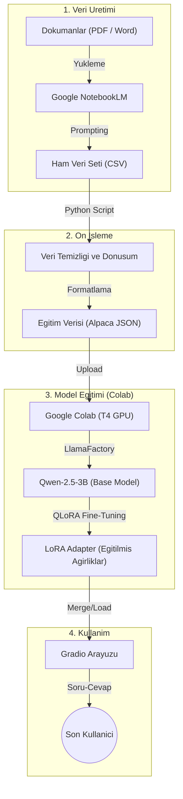
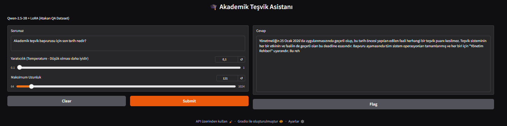

# 🎓 Fırat Üniversitesi Akademik Teşvik Asistanı (LLM Fine-Tuning)

Bu proje, Fırat Üniversitesi **2025-2026 Akademik Teşvik** süreçleri (Yönetmelik, Başvuru Rehberi ve Takvim) konusunda uzmanlaşmış, **Qwen-2.5-3B** tabanlı bir Yapay Zeka asistanı geliştirme çalışmasıdır.

Proje; ham dokümanlardan veri üretimi, verinin temizlenmesi, modelin eğitilmesi (**QLoRA**) ve son kullanıcı arayüzü (**Gradio**) aşamalarını kapsayan uçtan uca bir LLM iş akışıdır.

---

## 📊 Proje Akış Diyagramı

Aşağıdaki şema, verinin dokümandan modele nasıl dönüştüğünü özetler:



---

## 📂 Klasör Yapısı

```text
firat-akademik-tesvik-llm/
│
├── README.md                     # Proje dokümantasyonu
│
├── docs/                         # Kaynak Dokümanlar 
│   ├── Akademik_Tesvik_Yonetmeligi_Basvuru_Rehberi.docx
│   ├── Akademik_Tesvik_Odenegi_Yonetmeligi.pdf
│   └── Akademik_Tesvik_Takvimi_2026.pdf
│
├── data/                         # Veri Setleri
│   ├── dataset.csv           # NotebookLM'den alınan ham CSV
│   ├── dataset_info.json         # LlamaFactory veri konfigürasyonu
│   └── atakan_qa.json            # Eğitime hazır Alpaca JSON formatı
│
└── notebooks/                    # Kodlar / Notebooklar
    └── Training_Colab.ipynb      # Google Colab Eğitim Notebook'u
 
```

---

## ✅ Ön Koşullar

* **Python 3.10+** (yerelde veri dönüştürme için)
* **Google Colab + T4 GPU** (eğitim için)
* LlamaFactory (Colab notebook içinde kurulacak şekilde)


---

## 🚀 Kurulum ve Uygulama Adımları

### Adım 1: Veri Üretimi (NotebookLM)

`docs/` klasöründeki dokümanlar **Google NotebookLM**'e yüklenir. Aşağıdaki prompt ile dokümanlara dayalı Soru-Cevap (Q&A) verisi üretilir.


📋 NotebookLM Promptu 

```text
Aşağıdaki dokümanlardan SADECE içerikte açıkça geçen bilgilere dayanarak Question-Answer veri seti üret.

ÇIKTI FORMATI (CSV):
- Ayırıcı: noktalı virgül ;
- Her alan çift tırnak içinde olmalı.
- Satır sonu sadece kayıt bitince olsun.
- Alan içinde çift tırnak geçerse iki tırnak yap: "".
- Başlık satırı YAZMA.

KOLONLAR: "id";"question";"answer";"source_doc";"source_loc";"tags";"difficulty"

KURALLAR:
1) 1000 adet kayıt üret.
2) question: 8–25 kelime.
3) answer: 40–140 kelime; kısa, net.
4) source_doc: [Başvuru Rehberi] | [Yönetmelik] | [Takvim].
5) source_loc: Madde X, Tablo Y, Tarih aralığı vb.
6) tags: 3–6 anahtar kelime (örn: başvuru|yöksis).
7) difficulty: easy / med / hard.
8) Asla dokümanda olmayan bilgi ekleme.
````


**Çıktı:** `data/raw_dataset.csv`

---


### Adım 2: Veri Ön İşleme (CSV → Alpaca JSON)

NotebookLM’den gelen CSV verisi, LlamaFactory’nin kabul ettiği **Alpaca** formatına (`instruction`, `input`, `output`) dönüştürülür.

```bash
python notebooks/01_csv_to_json.py
```

**Çıktı:** `data/atakan_qa.json`

---

### Adım 3: Model Eğitimi (Google Colab)

Eğitim işlemi **Google Colab** üzerinde **T4 GPU** ile yapılır.

* **Framework:** LlamaFactory
* **Yöntem:** QLoRA (4-bit Quantization)
* **Model:** Qwen/Qwen2.5-3B-Instruct
* **Örnek Parametreler:**

  * `learning_rate`: 2e-4
  * `num_train_epochs`: 3
  * `lora_rank`: 16
  * `cutoff_len`: 1024

**Nasıl Çalıştırılır?**

1. `notebooks/Training_Colab.ipynb` dosyasını Colab’da aç.
2. `data/atakan_qa.json` (veya kullandığın dataset) dosyasını yükle / Drive’dan bağla.
3. Notebook hücrelerini sırayla çalıştır.
4. Eğitim çıktısı olarak **LoRA adapter** klasörü oluşur (`models/qwen2.5-lora-adapter/` gibi).

---
#### 📌 Eğitim Özeti (Dataset: 1000 Q&A)

Bu model, **1000 adet Soru-Cevap** kaydı ile (Alpaca JSON formatında: `data/atakan_qa.json`) fine-tune edilmiştir.

**Eğitim Konfigürasyonu (Training_Colab.ipynb):**
- **Base model:** `Qwen/Qwen2.5-3B-Instruct`
- **Stage:** SFT
- **Fine-tuning yöntemi:** LoRA / QLoRA
- **LoRA target:** `all`
- **LoRA rank (r):** `16`
- **LoRA alpha:** `32`
- **LoRA dropout:** `0.05`
- **cutoff_len:** `1024`
- **learning_rate:** `2e-4`
- **num_train_epochs:** `3`
- **max_samples:** `10000` *(üst sınır)*

> Not: Eğitim verisi `dataset.csv` dosyasından üretilerek JSON’a dönüştürülmüştür ve dönüştürme sırasında toplam kayıt sayısı ekrana yazdırılır.
---
### Adım 4: Test ve Arayüz (Gradio)

Eğitim tamamlandığında, `Training_Colab.ipynb` içindeki Gradio hücresi çalıştırılarak chat arayüzü açılır.

Aşağıda örnek Gradio arayüz ekran görüntüsü yer almaktadır:



**Örnek Soru:**

> “Akademik teşvik başvurusu için son tarih nedir?”

---


## 🛠 Kullanılan Teknolojiler

* **Google NotebookLM:** Sentetik Q&A veri üretimi (doküman tabanlı)
* **LlamaFactory:** Fine-tuning / QLoRA eğitim altyapısı
* **Qwen-2.5:** Temel LLM (Türkçe performansı iyi)
* **QLoRA (bitsandbytes):** Düşük bellek ile verimli eğitim
* **Gradio:** Demo arayüzü
* **Pandas:** Veri dönüştürme ve temizleme

---

## ⚠️ Önemli Notlar

1. **Encoding:** CSV dosyaları UTF-8 olmalı (TR karakter sorunu varsa CP1254 denenebilir).
2. **Colab Limitleri:** Ücretsiz Colab GPU süreleri sınırlı olabilir; checkpoint/çıktıları Drive’a almak mantıklı.
3. **Resmi Kaynak:** Modelin cevabı yardımcıdır; nihai referans ilgili yönetmelik ve resmi duyurulardır.

## 🤝 Katkıda Bulunma 

Katkılar memnuniyetle karşılanır.

1. Bu repoyu **fork**'layın.
2. Yeni bir branch oluşturun: `feature/xxx`
3. Değişiklikleri commit edin.
4. Pull Request (PR) açın.

PR açarken mümkünse şunları ekleyin:
- Ne değişti? (kısa özet)
- Neden değişti? (gerekçe)
- Test / doğrulama adımları

---

## 🧾 Lisans 

Bu proje **MIT License** ile lisanslanmıştır.

- Lisans metni için: `LICENSE` dosyasına bakın.
- Kısaca: MIT lisansı, projeyi kullanmanıza, değiştirmenize ve dağıtmanıza izin verir; telif hakkı ve lisans bildiriminin korunmasını şart koşar.

> Licensed under the MIT License. See `LICENSE` for details.

---

## 📌 Alıntılama 

Bu projeyi akademik veya rapor amaçlı kullanırsanız aşağıdaki gibi atıf verebilirsiniz:

```bibtex
@software{firat_akademik_tesvik_llm,
  author  = {Şahin Atakan Emre},
  title   = {Firat Universitesi Akademik Tesvik Asistani (LLM Fine-Tuning)},
  year    = {2026},
  url     = {https://github.com/Atakan-Emre/firat-akademik-tesvik-llm}
}

